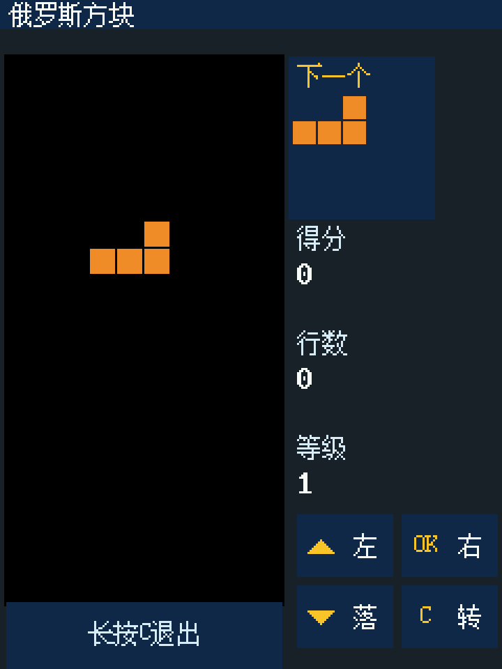
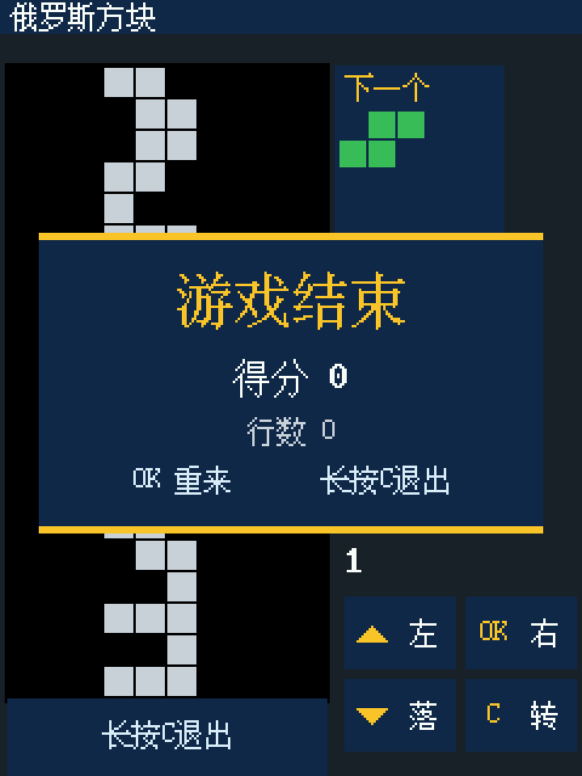
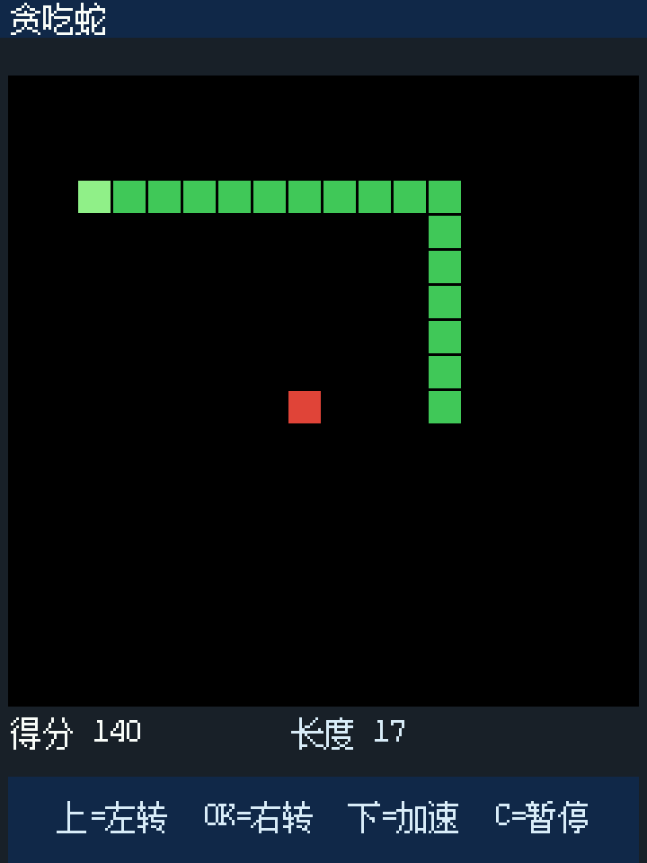
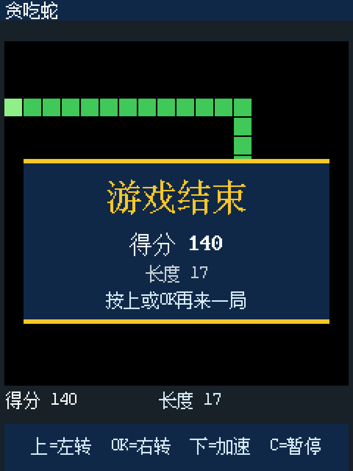

# H7-TOOL Lua 像素游戏合集

在 [H7-TOOL](https://www.armbbs.cn)（安富莱调试工具）的 240×320 屏幕上，用**纯 Lua** 编写的像素游戏合集。
下载到工具里就能**脱机玩**，不占电脑、不插 U 盘。

| 俄罗斯方块 · 游戏中 | 俄罗斯方块 · 结算 |
|---|---|
|  |  |

| 贪吃蛇 · 游戏中 | 贪吃蛇 · 结算 |
|---|---|
|  |  |

---

## 游戏列表

**俄罗斯方块**（`tetris.lua`，约 16 KB）

- 10×20 棋盘 + "下一个"预览 + 得分 / 行数 / 等级
- 消行、升级加速、结算面板
- **界面上直接画了四个按键的示意图**，不用记操作
- 17 项逻辑自测（旋转 4 次复原、四边界碰撞、消行、消行后上方下落等）

**贪吃蛇**（`snake.lua`，约 12 KB）

- **两键转向**：上=左转 90°、OK=右转 90° —— 相对转向**永远不会 180° 掉头**，不会"按快了把自己撞死"
- 下=按住加速、C=单击暂停
- 吃食物加分、分数越高自动提速（有上限）
- **穿墙开关**：文件顶部 `local WRAP = false`，改成 `true` 即穿墙（默认撞墙死）
- 27 项逻辑自测

| 文件 | 游戏 | 主要操作 |
|---|---|---|
| `tetris.lua` | 俄罗斯方块 | 上/OK 左右移动，下秒落，C旋转，电源暂停 |
| `snake.lua` | 贪吃蛇 | 上/OK 左右转，下切换加速，C切换穿墙，电源暂停 |
| `breakout.lua` | 打砖块 | 上/OK 左右移动，下发球，电源暂停 |
| `invaders.lua` | 小蜜蜂 | 上/OK 左右移动，下开火，电源暂停 |
| `flappy.lua` | 像素小鸟 | 上或OK跳跃，电源暂停 |
| `game2048.lua` | 2048 | 上/下/C/电源四方向，OK重开 |
| `sokoban.lua` | 推箱子 | 上/下/C/电源四方向，OK撤销/长按重开 |
| `bomber.lua` | 炸弹人 | 上/下/C/电源四方向，OK放炸弹 |

所有新增游戏统一使用深蓝信息面板、黄色强调色和一致的胜负横幅。长按 C 由固件中止脚本。

---

## 安装

把 `.lua` 文件放到工具的 EMMC：

```
0:/H7-TOOL/Lua/My/俄罗斯方块.lua
0:/H7-TOOL/Lua/My/贪吃蛇.lua
0:/H7-TOOL/Lua/My/打砖块.lua
0:/H7-TOOL/Lua/My/小蜜蜂.lua
0:/H7-TOOL/Lua/My/像素小鸟.lua
0:/H7-TOOL/Lua/My/2048.lua
0:/H7-TOOL/Lua/My/推箱子.lua
0:/H7-TOOL/Lua/My/炸弹人.lua
```

放进去有两种方式：

1. **U 盘模式**：工具进 U 盘模式，直接把文件拖进上面的目录
2. **在线传输**（推荐，不用拔插、DAP 不中断）：用 PC 端软件或 HID 通道写入

然后从**工具菜单**启动：

```
工具菜单 → Lua 脚本 → My → 选 俄罗斯方块.lua / 贪吃蛇.lua
```

> ⚠️ **一定要从菜单启动**。从 PC 端直接执行脚本时，`--GUIMODE=1` 不生效，固件会按"按任意键停止脚本"处理，表现为"一按键游戏就退出"。

---

## 操作

### 俄罗斯方块

| 按键 | 短按 | 长按 |
|---|---|---|
| 上 | 左移一格 | 连续左移 |
| OK | 右移一格 | 连续右移 |
| 下 | 秒落（直接到底） | —— |
| C | 旋转 | 退出 |

### 贪吃蛇

| 按键 | 作用 |
|---|---|
| 上 | 左转 90° |
| OK | 右转 90° |
| 下 | 切换加速 |
| C | 单击切换穿墙 |
| 电源 | 暂停 / 继续 |
| C（长按） | 退出 |

> 长按 C 退出是**固件行为**（"用户中止"），程序里不需要也不应该自己实现退出。

---

## 实现要点（给想写工具 GUI 小程序的同学）

这些都是实测出来的，能省不少时间：

### 1. `lcd_fill_rect` 的参数顺序是 `(x, y, h, w, color)`

**高度在前、宽度在后**，而且 `h`、`w` 的合法范围是 **1~240**。
超出范围会**越界写显存**，轻则画面出现莫名的横线，重则要重启工具。官方《Lua 小程序开发手册》写了这个限制，写之前值得先查一遍。

画竖线应该是 `h=高度, w=2`，别写反。

### 2. 五键事件码（实测 APP V2.33）

按键物理布局：左边 `上 / 下`，右边 `OK / C`。每个键产生 5 个事件，**号码不连号**：

| 键 | 按下 | 单击(弹起) | 长按触发 | 长按连发 | 长按弹起 |
|---|---|---|---|---|---|
| 上 | 1 | 2 | 3（约 620ms 后）| 5（约每 27ms）| 4 |
| 下 | 8 | 9 | 10 | 12 | 11 |
| OK | 15 | 100 | 17 | 19（**实测未连发**）| 18 |
| C | 22 | 101 | 24 | 26 | 25（长按 C = 固件"用户中止"）|
| 电源 | 29 | 30 | 31 | — | 32 |

两个要点：

- **不要用"按下 + 弹起都算一次"的写法**，否则按一下动两下；判断"单击"只匹配 `2 / 9 / 100 / 101` 即可
- **OK 键没有连发事件**：想实现"按住连续移动"，要在主循环里**自己计时**（本项目用每 3 帧一步，约 90ms）

### 3. `--GUIMODE=1` 必须是**固件下载的那个脚本**的第一行

如果 A 脚本 `dofile` 去跑 B 脚本，B 里的 `--GUIMODE=1` 只是注释，不生效。

### 4. 整屏重画，不要局部刷新

只重绘一小块会把屏幕画花。本项目采用"整屏 `lcd_clr` + 重画 + 每帧一次 `lcd_refresh()`"，`lcd_refresh()` 约 26ms，30fps 足够。

### 5. 自测钩子

俄罗斯方块和贪吃蛇文件末尾带有自测钩子：

```lua
if _G.H7_TETRIS_TEST then runTests() return end      -- tetris.lua
if _G.H7_SNAKE_TEST  then runTests() return end      -- snake.lua
```

设置这个全局变量后再 `dofile` 该文件，就只跑自测、不进入游戏，结果用 `print` 输出（`H7T DONE ok=N fail=M`）。逻辑改动后先跑自测再装机，能少走很多弯路。

---

## 已知限制

- **屏幕方向无法自动判断**：工具的"屏幕方向"设置会整体旋转画面，但 Lua 侧**没有对应的读取接口**（官方手册、配置文件和寄存器都找过了）。所以程序按**竖屏 240×320** 布局编写；如果你把屏幕设成横屏，玩法不变，把工具转过来看即可。
- **字库缺 `▼`**：竖屏时写 "▼" 不会显示。需要上下三角时用 `lcd_fill_rect` 逐行画实心三角（本项目就是这么做的）。
- **`os.remove` / `os.rename` 是空操作**，`f_dir()` 会让固件栈溢出卡死，Lua 里做不了文件管理器。

---

## 许可

MIT License，详见 [LICENSE](LICENSE)。
