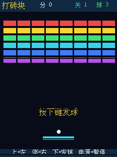
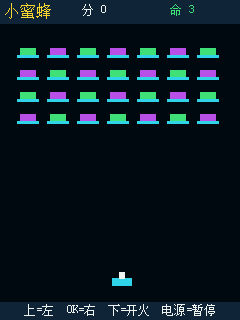
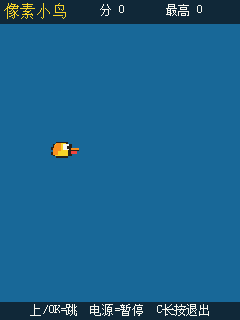
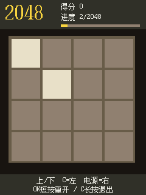
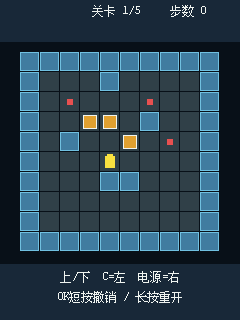
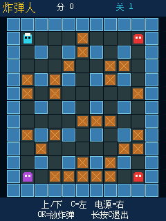

# H7-TOOL Lua 像素游戏合集

给安富莱 [H7-TOOL](https://forum.anfulai.cn/forum.php?mod=forumdisplay&fid=61&filter=typeid&typeid=370) 做的一组竖屏像素游戏。全部使用板端 Lua 编写，适配 240 × 320 LCD 和机身五键，复制到 EMMC 后即可脱机运行。

- 8 个可玩游戏，统一的深蓝像素风界面
- 统一的暂停、结算和过关横幅
- 针对上、下按键长按连发，以及 OK / 电源键的软件长按做了适配
- 俄罗斯方块和贪吃蛇内置逻辑自测

## 游戏画廊

以下画面均由 H7-TOOL 实机帧缓冲直接截取。

| 俄罗斯方块 | 贪吃蛇 |
|:---:|:---:|
|  |  |

| 打砖块 | 小蜜蜂 |
|:---:|:---:|
|  |  |

| 像素小鸟 | 2048 |
|:---:|:---:|
|  |  |

| 推箱子 | 炸弹人 |
|:---:|:---:|
|  |  |

## 安装

脚本按正文编码分为两个目录，两边均使用相同的中文文件名：

- [`UTF-8/`](UTF-8/)：无 BOM UTF-8，APP V2.33 实机使用过的版本；
- [`GBK/`](GBK/)：内容相同的 GBK 转码版本，供需要本地编码的旧环境使用。

从其中一个目录选择需要的 `.lua` 文件，复制到 H7-TOOL EMMC：

```text
0:/H7-TOOL/Lua/My/
```

可以使用 H7-TOOL 的 U 盘模式直接复制，也可以通过 PC 软件或 HID 文件接口在线传输：

```text
俄罗斯方块.lua  贪吃蛇.lua  打砖块.lua  小蜜蜂.lua
像素小鸟.lua    2048.lua    推箱子.lua  炸弹人.lua
```

然后在设备上打开：

```text
工具菜单 → Lua 脚本 → My → 选择游戏
```

> 必须从设备菜单启动正式游戏。PC 端临时执行 Lua 时，固件不会按菜单脚本的方式处理 `--GUIMODE=1`，按键可能直接中止脚本。

## 按键事件码

下表来自 APP V2.33 实机测试。按键号码并非连续排列，编写新游戏时不要根据键序号推算事件码。

| 键 | 按下 | 短按松开 | 长按 | 长按连发 | 长按后松开 |
|---|---:|---:|---:|---:|---:|
| 上 | 1 | 2 | 3 | 5 | 4 |
| 下 | 8 | 9 | 10 | 12 | 11 |
| OK | 15 | 100 | 17 | 19（实测不连续产生） | 18 |
| C | 22 | 101 | 24 | 26 | 25 |
| 电源 | 29 | 30 | 31 | — | 32 |

## 已知限制

- 所有游戏按竖屏 240 × 320 设计。Lua 侧没有读取当前屏幕方向的接口。
- 字库中的部分符号不可用；需要的三角形等图案由矩形或线段绘制。

## 许可

MIT License，详见 [LICENSE](LICENSE)。
